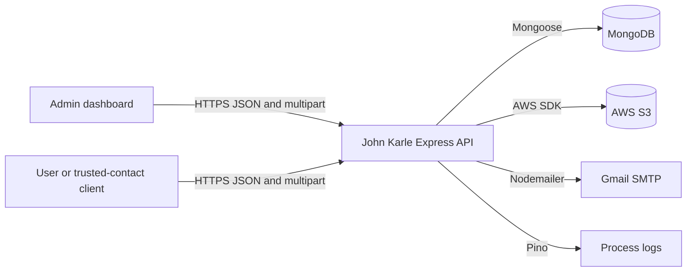
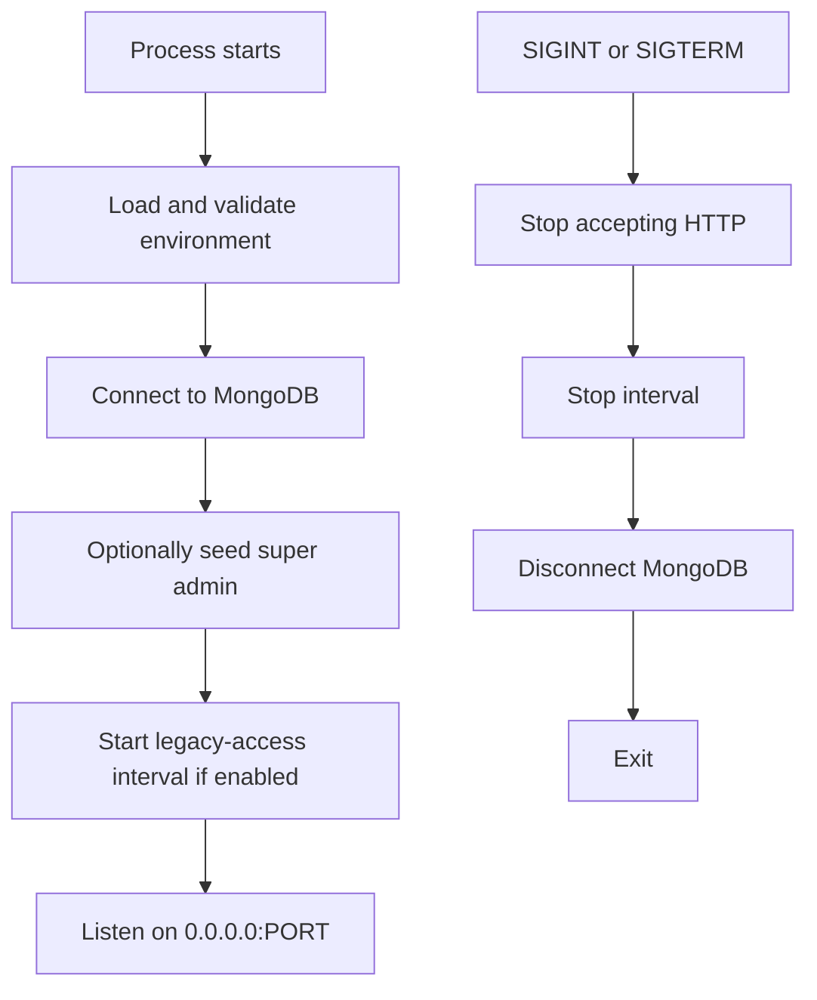
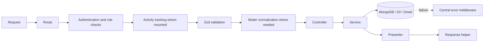
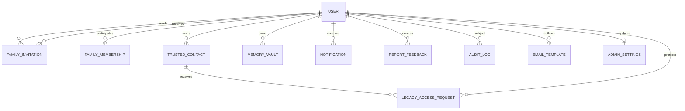
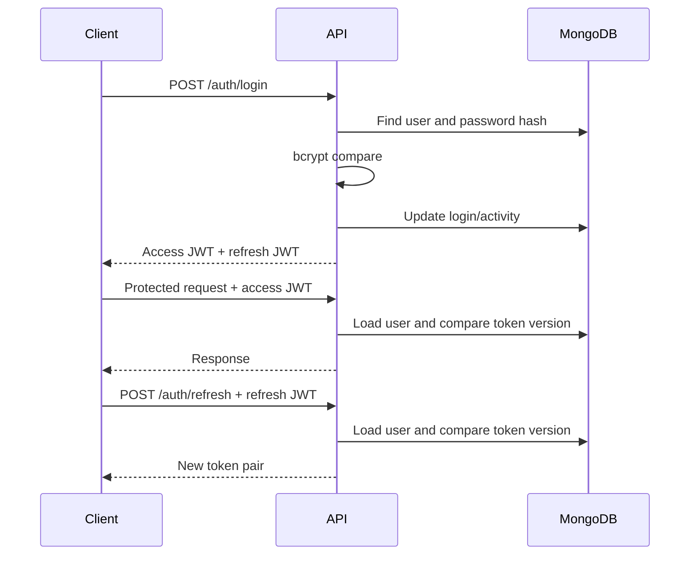
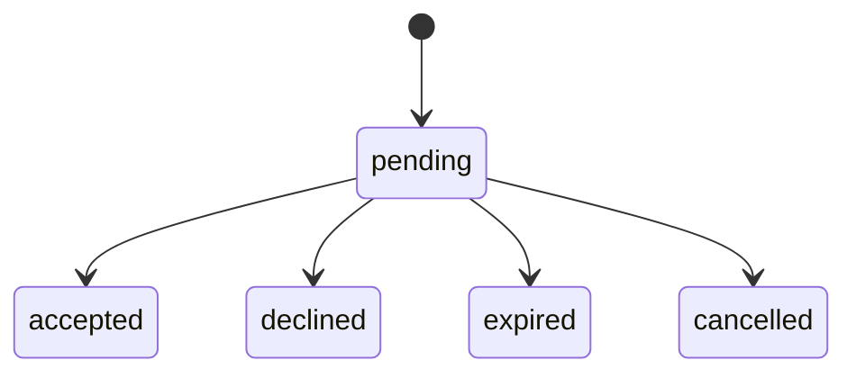
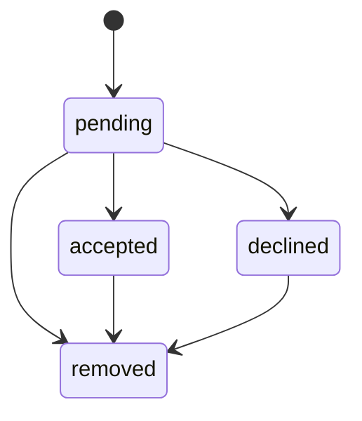
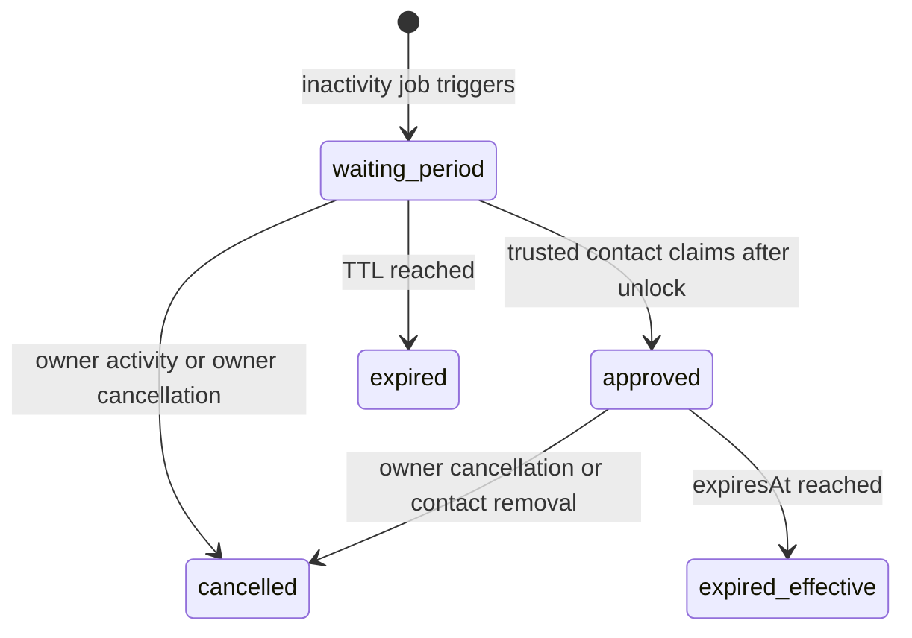
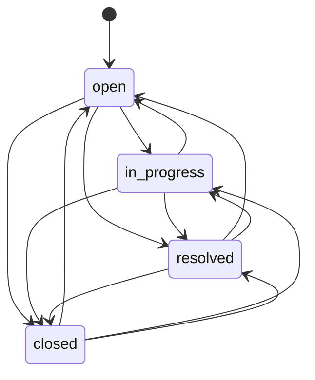
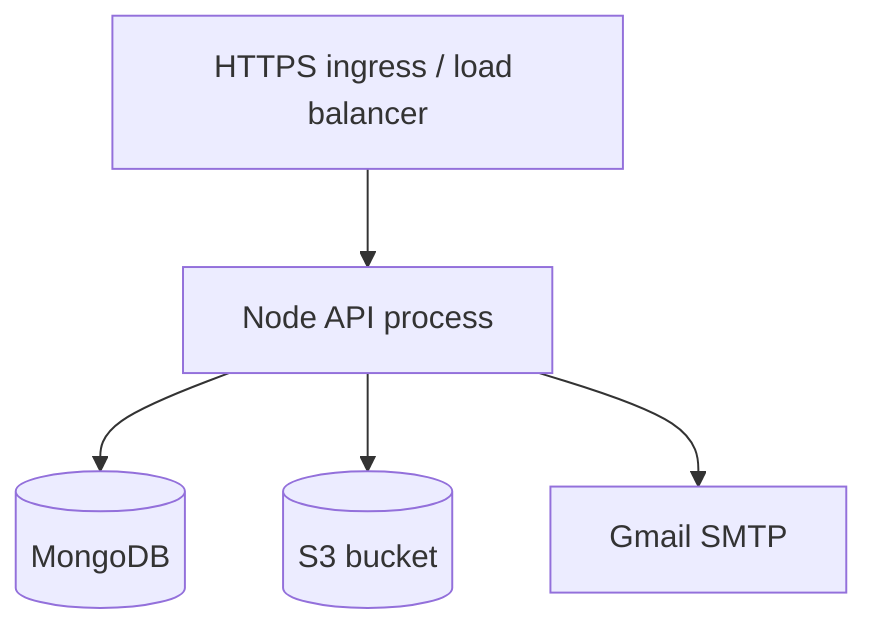

# Backend Architecture

## 1. Document Scope

This document describes the architecture implemented in the current `main` branch of the John Karle backend. It covers runtime structure, module boundaries, data ownership, security, state transitions, integrations, failure behavior, deployment constraints, and known risks.

The following product constraints are not recorded in the repository and remain unknown:

- Expected users, requests per second, and data volume
- Availability and recovery objectives
- Data residency, retention, privacy, and regulatory requirements
- Target number of runtime replicas
- Budget and operational team model

The system should not be classified as production-ready for a particular scale or compliance regime until those requirements are defined.

## 2. Architectural Style

The backend is a **layered modular monolith**:

- One Node.js process exposes one Express application.
- Feature modules share one MongoDB database and one deployment lifecycle.
- Modules are separated in source code but are not isolated services.
- Business operations may call MongoDB, S3, Gmail, notifications, and audit logging in the same request.
- Background legacy-access processing runs inside the API process.

This structure favors delivery speed and simple operations. It does not provide independent module scaling, distributed transactions, durable event delivery, or fault isolation between modules.

## 3. System Context



Trust boundaries:

1. Browser/client input is untrusted and crosses the HTTP boundary.
2. JWTs establish application identity but every protected request also loads the user from MongoDB.
3. MongoDB, S3, and Gmail are external dependencies with independent failure modes.
4. S3 object URLs are returned directly to clients; bucket access policy is therefore part of the effective security boundary.

## 4. Runtime and Startup Lifecycle

`src/server.ts` is the process entry point.



Key behavior:

- Environment variables are validated at import time with Envalid.
- MongoDB must connect before the HTTP listener starts.
- Super-admin seeding runs on every startup but creates only when the configured email does not exist.
- The legacy scheduler starts as an unreferenced `setInterval`; it does not run immediately on startup.
- Graceful shutdown stops the listener, stops the scheduler, and disconnects MongoDB.
- A 10-second fallback forces process exit if graceful shutdown does not finish.
- Startup failures are logged and terminate the process.

## 5. HTTP Processing Pipeline

`src/app.ts` applies middleware in this order:

```text
Helmet (global CSP disabled for Swagger compatibility)
  -> CORS with credentials
  -> compression
  -> JSON parser, 1 MB limit
  -> request/response logger
  -> URL-encoded parser
  -> global rate limit: 100 requests / 15 minutes
  -> Swagger, health, root, and favicon routes
  -> /api/v1 feature router
  -> 404 handler
  -> centralized error handler
```

Feature request flow:



Implementation conventions:

- Routes define middleware order and access control.
- Zod schemas validate params, query, and body.
- Controllers translate HTTP input/output.
- Services contain business rules and integrations.
- Mongoose models define persistence.
- Presenters map internal documents to public shapes.
- `ApiError` represents expected HTTP failures.
- `asyncHandler` forwards rejected promises to centralized error handling.

## 6. API Surface and Response Contract

All feature routes are mounted under `/api/v1`.

| Prefix              | Responsibility                                   | Default access         |
| ------------------- | ------------------------------------------------ | ---------------------- |
| `/auth`             | Registration, sessions, password reset           | Mixed public/protected |
| `/users`            | Profiles, family invitations and memberships     | Mixed public/protected |
| `/admin`            | Metrics, users, admins, email, settings, reports | Admin/super admin      |
| `/trusted-contacts` | Trusted-contact lifecycle                        | Mixed public/protected |
| `/legacy-access`    | Inactivity access lifecycle                      | Protected              |
| `/memory-vault`     | Memories and files                               | Protected              |
| `/notifications`    | User notification inbox                          | Protected              |
| `/report-feedback`  | User report/feedback workflow                    | Protected              |
| `/health`           | API health                                       | Public                 |

The complete endpoint inventory is in `API_DOCUMENTATION.md`.

Success envelope:

```json
{
  "success": true,
  "message": "Operation completed.",
  "data": {}
}
```

Paginated responses additionally include:

```json
{
  "meta": {
    "page": 1,
    "limit": 20,
    "total": 100,
    "totalPages": 5
  }
}
```

Error envelope:

```json
{
  "success": false,
  "message": "Validation failed",
  "errors": [
    {
      "code": "VALIDATION_ERROR",
      "path": "email",
      "message": "Invalid email"
    }
  ]
}
```

Development errors include a stack trace. Production errors do not.

## 7. Module Boundaries and Dependencies

| Module           | Owns                                                            | Important dependencies                                                     |
| ---------------- | --------------------------------------------------------------- | -------------------------------------------------------------------------- |
| Auth             | JWT issuance, login, refresh, logout, password reset            | Users, activity, audit, Gmail                                              |
| Users            | Profiles, invitations, family memberships, super-admin seed     | Auth re-use, S3, Gmail, notifications, audit                               |
| Admin            | Metrics, users, admin accounts, templates, bulk email, settings | Users, audit logs, Gmail, S3                                               |
| Trusted contacts | Contact invitations, access scope, inactivity threshold         | Users, auth reauthentication, legacy requests, Gmail, notifications, audit |
| Legacy access    | Activity tracking, waiting requests, claims, scoped data        | Users, trusted contacts, memory vault, Gmail, notifications, audit         |
| Memory vault     | Memory CRUD, family reads, S3 file lifecycle                    | Users/family memberships, S3, audit                                        |
| Notifications    | Inbox, unread state, broadcast, TTL                             | Users                                                                      |
| Report feedback  | Reports, replies, statuses, attachments                         | Users, S3, audit                                                           |
| Audit logs       | Append-only operational activity records                        | MongoDB                                                                    |
| Health           | Service health response                                         | None                                                                       |

Cross-module calls are direct TypeScript imports. There is no internal event bus, repository abstraction, queue, or dependency-injection container.

## 8. Persistence Model

MongoDB is the system of record. Relationships use ObjectId references, but most services query explicitly rather than relying on Mongoose population.

### 8.1 Collections

| Model                  | Primary responsibility                               | Important fields                                                                  | Important indexes/invariants                                     |
| ---------------------- | ---------------------------------------------------- | --------------------------------------------------------------------------------- | ---------------------------------------------------------------- |
| `User`                 | Identity, role, profile, auth invalidation, activity | email, passwordHash, role, refreshTokenVersion, lastActiveAt, legacyAccessEnabled | Unique email; indexes on activity and legacy flag                |
| `UserFamilyInvitation` | Pending and historical family invitations            | inviterId, inviteeUserId/email, tokenHash, status, expiresAt                      | Inviter/email/status compound; token and status indexes          |
| `UserFamilyMembership` | Accepted family relationship                         | requesterId, recipientId, pairKey, roles, status                                  | One accepted record per normalized pair via partial unique index |
| `TrustedContact`       | Owner-scoped trusted contact and access policy       | userId, email, status, inactivityDays, accessScope, invite token                  | User/email compound; status and identity indexes                 |
| `LegacyAccessRequest`  | Waiting/approved/cancelled/expired access request    | userId, trustedContactId, status, unlockAt, expiresAt                             | User/contact/status and status/expiry compounds                  |
| `MemoryVault`          | Memory metadata and S3 object references             | userId, type, files, title, narrative, date, tags                                 | User/date/createdAt compound                                     |
| `Notification`         | User inbox item                                      | recipient, actor, type, isRead, expiresAt                                         | Recipient/date, recipient/read/date; TTL on expiresAt            |
| `ReportFeedback`       | Report thread and attachments                        | userId, type, category, priority, status, replies                                 | User/status/date and admin filtering indexes                     |
| `AuditLog`             | Operational activity trail                           | userId, actor, action, target, metadata                                           | User/date, actor/date, action/date, target/date                  |
| `EmailTemplate`        | Admin-managed email content                          | templateName, subjectLine, content, authors                                       | Unique template name; updatedAt ordering                         |
| `AdminSettings`        | Singleton dashboard content settings                 | key, terms, privacy, about, updatedBy                                             | Unique singleton key                                             |

### 8.2 Logical Relationship Map



### 8.3 Data Consistency Model

- MongoDB multi-document transactions are not used.
- Cross-document and external-service workflows use sequential writes and selective compensation.
- Audit entries are generally awaited, but they are separate writes.
- Notifications are often best-effort (`void ...catch`) and may be lost without failing the originating request.
- Email is sometimes part of the critical path and sometimes follows a state change.
- There is no outbox, idempotency-key store, saga coordinator, or repair worker.

Consequences:

- Partial state is possible when a later step fails.
- Retrying a request may encounter a state created by the first attempt.
- Durable delivery of email, notifications, and audit side effects is not guaranteed as one atomic unit.

## 9. Authentication and Session Architecture

### 9.1 Token Model

- Access and refresh tokens are signed JWTs using the same `JWT_SECRET`.
- Payload contains user ID, email, role, token type, and `refreshTokenVersion`.
- Access and refresh lifetimes are configured independently.
- Refresh tokens are not stored individually in MongoDB.
- `refreshTokenVersion` provides user-wide invalidation.

Protected request validation:

1. Parse `Authorization: Bearer <token>`.
2. Verify signature, expiry, payload shape, and token type.
3. Load the user from MongoDB.
4. Compare the token version with the user's current version.
5. Attach ID, email, role, and version to `req.user`.

This makes access tokens cryptographically stateless but still performs a database read for every authenticated request.

### 9.2 Session Lifecycles



Logout increments `refreshTokenVersion`, invalidating all access and refresh tokens issued with the previous version. Password reset also increments the version.

### 9.3 Password Reset

1. Generate a six-digit code.
2. Store only its SHA-256 hash and expiry.
3. Email the raw code.
4. Successful verification clears the code and returns a random reset token.
5. Store only the reset-token hash and expiry.
6. Successful reset bcrypt-hashes the new password, increments token version, and clears reset state.

Unknown email requests intentionally return the same message to reduce account enumeration.

### 9.4 Roles

Application roles:

- `user`
- `admin`
- `super_admin`

`authorizeAdmin` accepts admin and super admin. `authorizeSuperAdmin` accepts only super admin.

Family roles (`viewer`, `editor`, `owner`) are stored as relationship metadata. The current memory-vault authorization does **not** enforce these role distinctions: any accepted family member can read the counterpart's memories, and only the memory owner can mutate them.

## 10. Family Invitation and Membership Lifecycle



Creation:

- Self-invites, existing accepted relationships, and duplicate pending invites are rejected.
- A secure raw token is generated; only its SHA-256 hash is stored.
- Invitation lifetime is currently fixed at 24 hours in service code.
- If the email is not registered, a user record and temporary password are created before acceptance.
- The inviter also receives a denormalized pending entry in `User.familyMembers`.
- Email failure compensates by deleting the invitation and newly created user and restoring the inviter entry.
- Existing users receive an in-app notification; the current service only sends invitation email for newly created users.

Acceptance:

- Token-based acceptance is public; ID-based acceptance requires the matching authenticated invitee.
- Expired invitations transition to `expired` when acceptance is attempted.
- Acceptance creates/reactivates a canonical `UserFamilyMembership`.
- Both users' denormalized `familyMembers` arrays are also synchronized for compatibility.
- Notifications are best-effort; audit creation is awaited in the token flow.

Architectural note: canonical memberships and denormalized `familyMembers` coexist. Reads may use either path depending on endpoint. This duplication requires explicit synchronization and is a drift risk.

## 11. Trusted-Contact Lifecycle



Creation and updates require password reauthentication. Each contact belongs to one owner and defines:

- Inactivity threshold: 30–365 days
- Status
- Contact identity
- Access scope: profile, documents, notes, messages, payment information, account transfer

Invitation behavior:

- A secure token hash and configured expiry are stored.
- Gmail delivery is critical during creation; failure deletes the newly created contact.
- Acceptance/decline can occur through a public token or an authenticated invitation ID.
- Token material is cleared after acceptance, decline, or removal.
- Removal cancels active waiting and approved legacy-access requests for that contact.

The `(userId, email)` index is not unique. Service checks prevent duplicate pending/accepted contacts during normal writes, but concurrent requests can still create duplicates.

## 12. Legacy-Access Architecture

### 12.1 State Machine



`expired_effective` above describes runtime behavior, not a stored enum transition: data access rejects an approved request after `expiresAt`, but the current daily job only updates expired `waiting_period` records. An approved record may therefore remain stored as `approved` after it is no longer usable.

### 12.2 Activity Tracking

- Most protected feature routers mount `trackAuthenticatedUserActivity`.
- `lastActiveAt` writes are throttled by `LEGACY_ACCESS_ACTIVITY_TOUCH_INTERVAL_MINUTES`.
- A successful activity write cancels all `waiting_period` requests for the owner.
- Login forces cancellation even if activity was updated within the throttle window.
- Activity-side-effect failures are logged as warnings and do not fail the request.
- Approved requests are not cancelled by generic activity tracking.

### 12.3 Scheduler

At each interval:

1. Mark expired waiting requests as `expired`.
2. Load every user with `legacyAccessEnabled=true`.
3. Load each user's accepted trusted contacts.
4. Compare the best available activity timestamp with each contact's inactivity threshold.
5. Skip contacts with an existing waiting or approved request.
6. Create a waiting request with configured unlock and expiry timestamps.
7. Email owner and trusted contact.
8. Write an audit event.
9. Attempt best-effort notifications.

The algorithm is sequential and query-heavy: users × trusted contacts produces repeated database operations. It has no distributed lock or unique active-request constraint. Multiple API replicas can run the same scheduler and race to create duplicate requests.

Email is sent after the request is created. If email fails, the request remains and subsequent runs skip it as active, so warning delivery may not be retried.

### 12.4 Claim and Data Access

A trusted contact is matched by authenticated email and accepted contact status. Claim requires:

- Stored state is `waiting_period`
- Current time is at or after `unlockAt`
- Current time is before `expiresAt`
- Contact remains accepted

Claim writes `approved` before emailing the owner. If email fails, the request remains approved while the HTTP operation may report failure.

Approved data is assembled dynamically from current owner data and current contact scope:

| Scope             | Implemented data                 |
| ----------------- | -------------------------------- |
| `profile`         | Public user profile              |
| `documents`       | Non-journal memory-vault entries |
| `notes`           | Journal memory-vault entries     |
| `messages`        | Empty array placeholder          |
| `paymentInfo`     | Not returned                     |
| `accountTransfer` | Not returned                     |

Every successful legacy data view creates an awaited audit record.

## 13. Memory-Vault and File Architecture

Memory types are `photo`, `video`, `journal`, and `voice`.

Authorization:

- Owners can create, update, and delete.
- Owners and accepted family members can read.
- A family member's stored role is not evaluated for read access.
- Journal memories may have zero files; other types require at least one.

Upload constraints:

- In-memory Multer storage
- Up to 10 files
- Up to 25 MB per file
- Accepted fields: `file` and `files`

S3 object keys:

```text
memory-vault/{userId}/{timestamp}-{uuid}.{extension}
```

Create compensation:

1. Upload all files to S3.
2. Create MongoDB record.
3. Create audit record.
4. On failure, attempt to delete newly uploaded objects.

Update compensation:

1. Upload replacement files.
2. Save metadata and new references.
3. Create audit record.
4. Best-effort delete previous files.
5. On pre-completion failure, best-effort delete new files.

Delete behavior:

1. Delete MongoDB record.
2. Best-effort delete S3 files.
3. Create audit record.

This ordering favors removal of the database record but can leave orphaned S3 objects. S3 cleanup failures are intentionally swallowed.

Object URLs are constructed as public bucket URLs. There is no signed-URL service, application download proxy, object-level authorization, or explicit server-side encryption configuration in this codebase.

## 14. Profile and Report Attachments

Profile pictures:

- In-memory upload
- One file, up to 10 MB
- Field must be `profilePicture` or `profileImage`
- Replacements upload first, save user, then best-effort delete the previous object

Report/feedback attachments:

- In-memory upload
- Up to 5 files, 5 MB each
- Images, PDF, Word documents, and text
- Stored under `report-feedback/{userId}/...`
- Initial messages and embedded replies store attachment metadata
- Uploads are compensated on create/reply persistence failure

Because buffers are held in process memory, concurrent large uploads directly increase API memory pressure.

## 15. Report/Feedback Workflow

Report types are `problem` and `feedback`; statuses are `open`, `in_progress`, `resolved`, and `closed`.



The diagram reflects current validation: admins may set any enum status from any current status. There is no enforced transition matrix. Replies are rejected while the report is `closed`; reopening permits replies again.

User access is owner-scoped. Admin routes can list, read, reply, and change status. Replies are embedded in the report document, so long conversations grow one MongoDB document toward the document-size limit.

## 16. Notification Architecture

- Notifications are stored per recipient.
- Listing excludes expired notifications even before TTL deletion.
- MongoDB TTL automatically deletes records with `expiresAt`.
- Users can read, mark one/all as read, and delete their own notifications.
- Admin broadcast inserts notifications for selected recipients or all `user`-role accounts.
- Most domain-triggered notifications are best-effort and do not fail the main operation.

There is no push/WebSocket transport, retry queue, delivery receipt, or deduplication key. Notifications are an in-application inbox only.

## 17. Audit and Observability

### 17.1 Audit Logs

Audit records identify:

- Protected user/subject
- Optional actor and actor type
- Action
- Optional target
- Arbitrary metadata
- Optional IP and user agent

Admin recent-activity queries read audit logs and sanitize sensitive-looking metadata keys before returning them.

Audit logs are mutable MongoDB documents from a database-permission perspective; the application exposes no edit/delete route, but there is no append-only database control, hash chain, immutable archive, or retention policy.

### 17.2 Process Logs

Pino writes structured logs, with pretty output in development. Request logging captures:

- Method and URL
- Params, query, and body
- Response body and status
- Duration

Known sensitive key names are recursively redacted, arrays/depth are limited, and long strings are truncated. Sensitive content stored under an unexpected key can still be logged. Production log access and retention must be treated as a privacy control.

### 17.3 Health

`/health` and `/api/v1/health` return process-level success. They do not actively verify MongoDB, S3, or Gmail at request time. Since startup waits for MongoDB, initial readiness implies a successful connection, but later dependency degradation is not represented.

## 18. Security Controls

Implemented controls:

- Helmet security headers
- CORS configuration
- Global and selected route-specific rate limiting
- JWT signature/type/expiry validation
- Database-backed token-version invalidation
- Bcrypt password hashing
- SHA-256 storage for invitation/reset secrets
- Timing-safe invitation-token comparison
- Zod validation
- Role middleware
- Owner/contact/family query scoping
- Multer size/count/type constraints
- Log and admin-metadata redaction
- Password reauthentication for trusted-contact and legacy settings

Important limitations:

- Helmet CSP is disabled globally for Swagger compatibility.
- Default CORS is permissive; production must use explicit origins.
- JWT access and refresh tokens share one secret.
- No refresh-token rotation or per-device session store exists.
- No CSRF design is needed for bearer headers, but client token storage security remains critical.
- S3 URLs assume direct object readability.
- No malware scanning or content inspection exists for uploads.
- No account lockout, MFA, distributed rate limit, or bot protection exists.
- Rate limits are in-process and reset independently per replica.
- No field-level encryption exists for sensitive MongoDB content.
- Secrets depend on environment management outside the repository.

## 19. Failure Handling and Recovery

| Failure                                  | Current behavior                                 |
| ---------------------------------------- | ------------------------------------------------ |
| MongoDB unavailable at startup           | Process exits                                    |
| MongoDB request error                    | Central 500 response and error log               |
| Gmail missing credentials                | Mail-dependent operation returns 500             |
| S3 missing credentials                   | Upload-dependent operation returns 500           |
| New S3 upload followed by DB failure     | Best-effort delete new object                    |
| Old S3 object deletion failure           | Operation usually succeeds; orphan may remain    |
| Best-effort notification failure         | Main operation succeeds; notification is lost    |
| Awaited audit failure after domain write | Request can fail after domain state has changed  |
| Legacy scheduler callback failure        | Error is swallowed; next interval tries again    |
| Process termination                      | In-flight work has no durable recovery mechanism |

There is no database migration framework, backup/restore script, dead-letter queue, reconciliation job, or formal disaster-recovery procedure in the repository.

## 20. Performance and Scaling Characteristics

Current strengths:

- Stateless HTTP instances apart from scheduler interval and cached SDK/mail clients
- Indexed common ownership, status, and date queries
- Pagination for admin users, audit activity, notifications, templates, and reports
- Compression and bounded JSON payloads

Current limits:

- Authenticated requests add a MongoDB user lookup.
- Rate limiting is not shared across replicas.
- Scheduler work is sequential and not leader-elected.
- In-memory uploads can produce high peak memory usage.
- Memory-vault listing and timeline are unpaginated.
- Legacy-access data may load all owner memories.
- Family roles do not provide granular read filtering.
- Admin regex search may be expensive at scale.
- Embedded report replies can grow large documents.
- No cache, CDN abstraction, read replica, queue, or search index is used.

Revisit the design when measured load, latency, memory, job duration, or collection size exceeds agreed service objectives—not solely because of projected growth.

## 21. Deployment Topology

Minimum topology:



For multiple API replicas, the current scheduler must be addressed first:

- Disable it on all but one designated process, or
- Move it to a separate worker, or
- Add distributed leader election/locking and an active-request uniqueness invariant.

Deployments must provide:

- Node.js runtime and `PORT`
- MongoDB connectivity
- Strong production JWT secret
- Explicit dashboard/client CORS origins
- S3 and Gmail configuration for enabled features
- HTTPS termination
- Persistent centralized logs
- External MongoDB/S3 backup and retention controls

## 22. Testing and Contract Governance

Vitest covers routes, middleware, token handling, and major services. The repository requires route contract changes to update:

1. Route and Zod validation
2. Controller/service behavior
3. Swagger annotations
4. Postman collection
5. Route/service tests
6. Dashboard consumers when response shapes change

Current tests are primarily unit/service/HTTP tests with mocks. The repository does not define full integration tests against real MongoDB/S3/Gmail, load tests, security tests, or end-to-end deployment tests.

## 23. Architectural Decisions and Trade-offs

### ADR-001: Layered Modular Monolith

- **Status:** Accepted by implementation
- **Decision:** One Express process and one MongoDB database, organized by feature modules.
- **Benefits:** Simple local development, deployment, debugging, and cross-feature work.
- **Trade-offs:** Shared failure domain, direct coupling, no independent scaling.
- **Revisit trigger:** A module requires independent ownership, scaling, availability, or release cadence.

### ADR-002: MongoDB with Mongoose

- **Status:** Accepted by implementation
- **Decision:** Document storage with ObjectId references and selected embedded data.
- **Benefits:** Flexible domain documents, productive TypeScript/Mongoose workflow.
- **Trade-offs:** Application-managed relations, denormalization drift, embedded-document growth.
- **Revisit trigger:** Strong multi-entity transactional requirements, relational reporting, or document-size pressure becomes dominant.

### ADR-003: JWT with Version-Based Invalidation

- **Status:** Accepted by implementation
- **Decision:** Signed access/refresh JWTs plus a user-level token version.
- **Benefits:** Simple tokens and immediate user-wide invalidation.
- **Trade-offs:** Database lookup per request, no per-device session revocation, no refresh rotation.
- **Revisit trigger:** Device/session management, stolen-token detection, or higher auth throughput is required.

### ADR-004: Direct S3 Object Storage

- **Status:** Accepted by implementation
- **Decision:** API receives in-memory multipart files, uploads through AWS SDK, and returns bucket URLs.
- **Benefits:** Simple implementation and object storage scalability.
- **Trade-offs:** API memory pressure, public-URL assumption, best-effort cleanup.
- **Revisit trigger:** Private media, very large files, high upload concurrency, virus scanning, or direct-to-S3 upload is required.

### ADR-005: In-Process Legacy Scheduler

- **Status:** Accepted for current single-process operation
- **Decision:** Run periodic legacy-access evaluation in the API process with `setInterval`.
- **Benefits:** No separate worker infrastructure.
- **Trade-offs:** No durable schedule, leader election, retry policy, or safe multi-replica execution.
- **Revisit trigger:** More than one API replica, missed-job intolerance, long job duration, or reliable retry requirements.

### ADR-006: Best-Effort Secondary Side Effects

- **Status:** Mixed implementation
- **Decision:** Some notifications and cleanup steps are non-blocking; email and audit are often awaited.
- **Benefits:** Main workflows can continue when non-critical notification/cleanup fails.
- **Trade-offs:** Inconsistent user communication, partial state, and orphaned objects.
- **Revisit trigger:** Delivery guarantees, compliance-grade audit, or automated reconciliation is required.

## 24. Priority Architectural Risks

| Priority | Risk                                                      | Impact                                        | Recommended direction                           |
| -------- | --------------------------------------------------------- | --------------------------------------------- | ----------------------------------------------- |
| High     | Multiple replicas run the legacy scheduler                | Duplicate requests/emails and race conditions | Single worker plus lock/unique active invariant |
| High     | Legacy scope flags exceed implemented data                | Incorrect product/security expectations       | Implement or remove unsupported scopes          |
| High     | Directly readable S3 URLs                                 | Private memories may be exposed by URL        | Private bucket and authorized signed URLs       |
| High     | No atomicity/outbox across DB, email, audit, notification | Partial workflows and lost side effects       | Transactions where possible plus outbox/retry   |
| Medium   | Family roles are stored but not enforced                  | Viewer/editor/owner semantics are misleading  | Define and enforce permission matrix            |
| Medium   | In-memory multipart uploads                               | Memory exhaustion under concurrency           | Direct uploads/streaming and concurrency limits |
| Medium   | Approved legacy requests are not persisted as expired     | State/reporting drift                         | Expire both waiting and approved records        |
| Medium   | Full request/response body logging                        | Privacy leakage under unknown keys            | Route-aware allowlist logging                   |
| Medium   | No pagination for memories/timeline                       | Slow reads and large responses                | Cursor pagination and bounded legacy reads      |
| Low      | Dual family representations                               | Data drift and maintenance overhead           | Migrate reads to canonical membership model     |

## 25. Change Rules

When changing architecture:

- Update this document when module ownership, state transitions, data relations, integrations, security boundaries, or deployment behavior changes.
- Record new environment variables in `.env.example` and `ENVIRONMENT.md`.
- Update `API_DOCUMENTATION.md`, Swagger, Postman, and tests for route contracts.
- Add a decision record for a significant new pattern or infrastructure dependency.
- Document migration, rollback, compatibility, and operational ownership before deploying a persistence or topology change.
